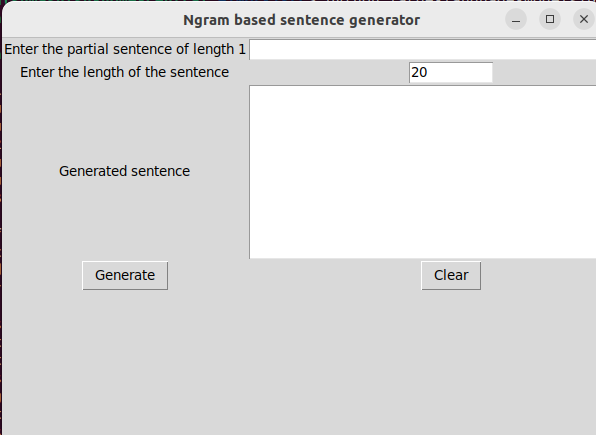
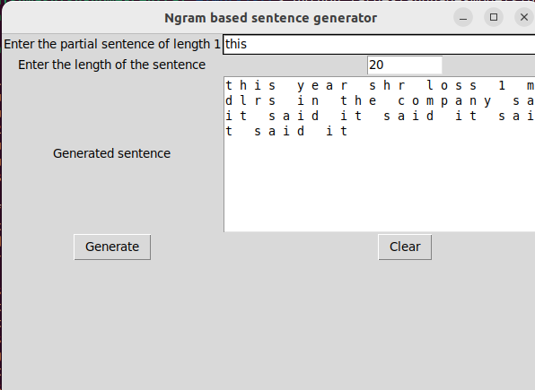

## N-Gram Language Model for Next Word Prediction

The objective of this project is to develop a language model capable of predicting the next word in a sentence based on n-gram statistics. N-grams are contiguous sequences of n words in a text, and this approach harnesses the statistical information about these sequences to make word predictions. This project was developed as a part of the DS 5983 course with Northeastern University in Spring, 2024.

### Pre-requisities
The project requires requires external libraries which are captured in [requirements.txt](requirements.txt). To install the external libraries, run the following command.
```bash
pip install -r requirements.txt
```

This program also requires tkinter which is usually available in the python stl. If it's not available, please run the command below.
```bash
sudo apt-get install python3-tk
```

### Running the project

The main program resides in the [n_gram_runner.py](runner/n_gram_runner.py). To launch the program run the following command from the current directory.
```bash
python runner/n_gram_runner.py [--dataset reuters or gutenberg] [--ngram | number for the n=gram] [--remove-numbers | true or false] [--train-split | ratio of train vs test] [--test | true or false] [--gui | true or false]
```
Optional command line arguments:
- --dataset - The dataset to use for training, demo and test. Currently available dataset: `reuters` or `gutenberg` from the `nltk` library. The default value is `reuters`
- --ngram - The value of `n` for the n-gram. The default value is 2.
- --remove-numbers - Set true to remove numbers, digits, fractions, roman numerals, and currencies from the text. The default value is false.
- --train-split - The ratio of dataset to be used for training. The default value is `0.9`.
- --test - Run tests on the test dataset. For each n-gram in the test dataset, the program tests if the predicted word for (n-1) matches the nth word. The default value is false.
- --gui - Runs the gui that creates user interface that allows users to input a prefix and receive word suggestions that match the specified length. The default value is false.

### Test run with gui

If the installation of pre-requisites is successful and the program is launched with the correct arguments, then the expected output is shown below.

- Before generation



- After generation


